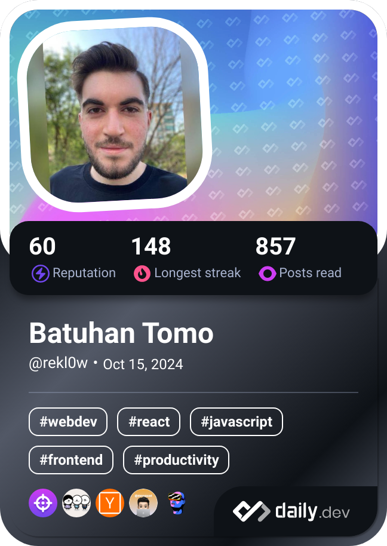

  

# Hi, I'm Batuhan

- 🔭 I’m currently working as a Software Engineer.
- 👨‍💻 My personal website -> [Rekl0w](https://rekl0w.github.io)

## 💻 Programming Languages

## 🎨 Frontend Frameworks & Libraries

## 🎭 Markup & Styling

## 📦 State Management & Build Tools

## ⚙️ Backend & Runtime

## 🗄️ Databases

## 🐳 DevOps & Infrastructure

## 🔧 Version Control & CI/CD

## 🛠️ Developer Tools

## 🖥️ Operating Systems & Platforms

## Connect With Me

  

## Dev Card

## Latest Blog posts

<!-- BLOG-POST-LIST:START -->
- [“Just Ship It”: Because Why Not ?](https://medium.com/@batuhantomo/just-ship-it-because-why-not-4a4a46131906?source=rss-aaa8e0af089------2)
- [“Just Ship It”: Çünkü Neden Olmasın ?](https://medium.com/@batuhantomo/just-ship-it-%C3%A7%C3%BCnk%C3%BC-neden-olmas%C4%B1n-82f7f1a884ae?source=rss-aaa8e0af089------2)
- [Software is Dead &lpar;!&rpar; What Are We Going to Do Now?](https://medium.com/@batuhantomo/software-is-dead-what-are-we-going-to-do-now-a20628c95100?source=rss-aaa8e0af089------2)
- [Yazılım bitti &lpar;!&rpar; Şimdi ne yapacağız ?](https://medium.com/@batuhantomo/yaz%C4%B1l%C4%B1m-bitti-%C5%9Fimdi-ne-yapaca%C4%9F%C4%B1z-eb114087989b?source=rss-aaa8e0af089------2)
- [Model Context Protocol &lpar;MCP&rpar;: The Bridge That Gives AI Superpowers](https://medium.com/@batuhantomo/model-context-protocol-mcp-the-bridge-that-gives-ai-superpowers-183a1ec0f6ba?source=rss-aaa8e0af089------2)
- [Model Context Protocol &lpar;MCP&rpar;: AI’ya Süper Güçler Veren Köprü](https://medium.com/@batuhantomo/model-context-protocol-mcp-aiya-s%C3%BCper-g%C3%BC%C3%A7ler-veren-k%C3%B6pr%C3%BC-c118c8324ac3?source=rss-aaa8e0af089------2)
<!-- BLOG-POST-LIST:END -->
